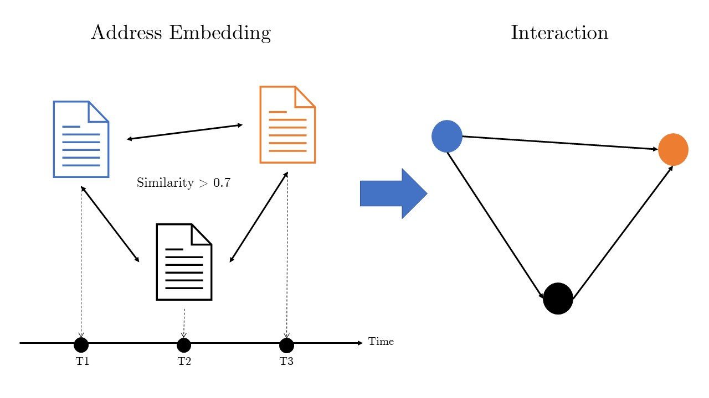

# thesis

This is the repository for the source code used in my thesis entitled "International issue analytics system based on document embedding and sentiment analysis".

## Abstract

With the improvement of Internet and mobile technologies, the international situation is moving rapidly. As such, a large amount of data that scholars who analyze international politics have to analyze will be poured out a day. Accordingly, it is necessary to quickly analyze the data pouring out in real time, but political scientists are still conducting research in a classical way, interpreting the meaning while reading the text. As a result, it is difficult to find academic meaning in real time in the rapidly changing international situation. Therefore, this paper proposes an analysis automation method to assist researchers in international politics.

The method proposed in this paper is to automatically analyze international politics-related documents such as diplomatic documents and presidential speeches through natural language processing, such as Doc2Vec and sentiment analysis, and to assist political scientists in obtaining academic sites through visualization. In this paper, the analysis was conducted using the proposed method as an example of the speech analysis of the leaders of South Korea, the U.S., and Japan, and as a result, South Korea, the U.S., and Japan were found to have particularly active interactions on North Korean issues, and North Korea's stance was generally negative.

Through the method presented in this paper, it is expected that automation methods will be introduced in the field of political science that relied on the manual work of existing researchers, and accordingly, the general public will be able to access the analysis of issues that are trending every moment.

## Method

In this paper, interactions are defined as follows. In the case of interaction, it is defined as the form of an edge connecting speeches from several countries that mentioned an issue. In the case of the edge, speeches with high similarities between documents were connected. The reason for this definition is that it is assumed that documents with high similarity in content deal with the same issue. Here, the edge refers to a line connecting two or more nodes in network analysis. However, it should be noted that this methodology needs to unify the language because it mainly aims to bind speeches from countries with various languages. Therefore, a procedure for unifying the language in the preprocessing process is necessary.

## Stance

On a particular political issue, stance regarded it as the sensitivity of the politician's remarks on the issue. It was interpreted that if there are many negative words in politicians' words on an issue, it is negative stance, and if there are many positive words, it is positive stance. Under the framework of this concept, this paper modeled the response of the leaders of each country to international issues. Specifically, this stance was calculated through sentiment analysis, one of the natural language processing methods.

In the case of the stance score, it was calculated by combining the sentimental dictionary mentioned above and the sentiment dictionary composed of experts' annotations. For words listed in the sentiment dictionary, the word was replaced by the sentiment score of the word, and the rest was replaced by zero. The scores were then averaged and then stanced based on the following criteria.

